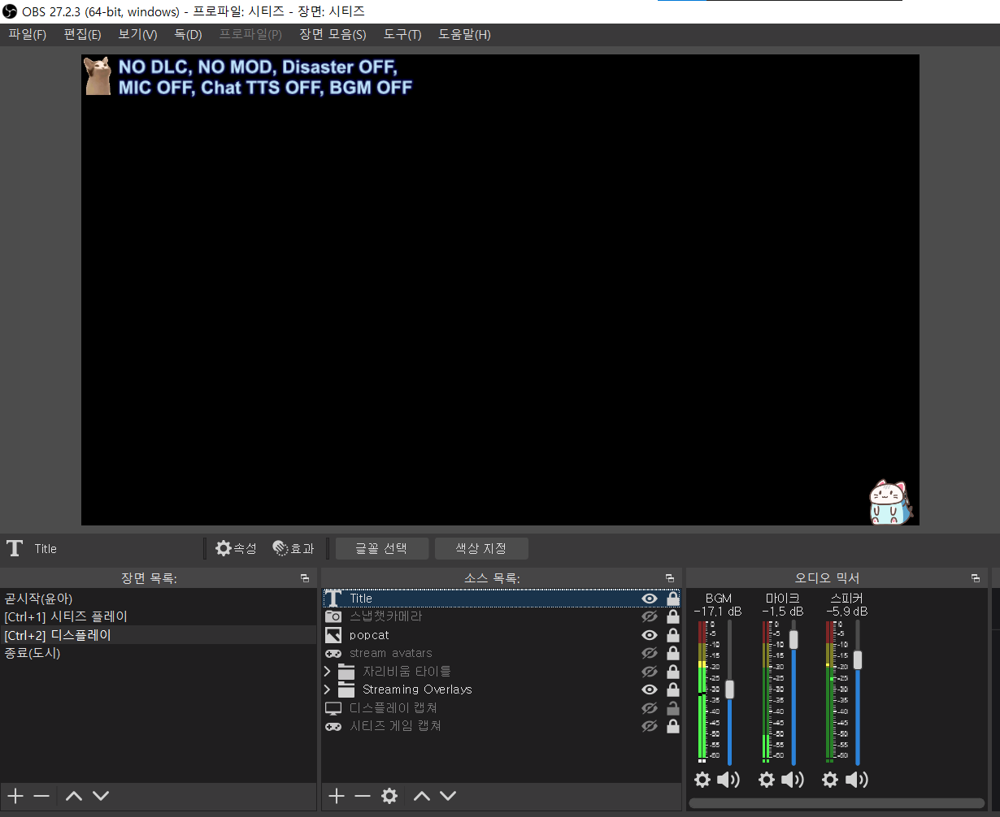
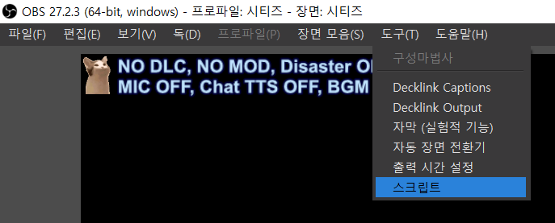
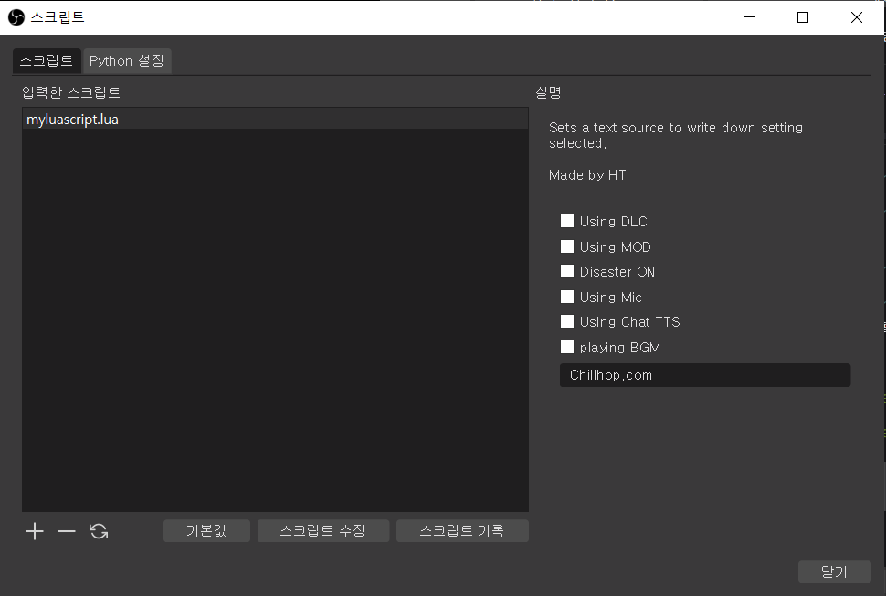
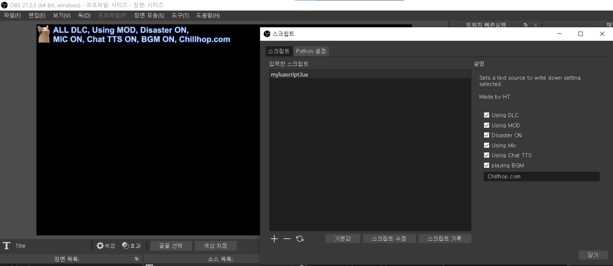

## obs-script1
learn LUA script from https://www.lua.org/pil/1.html  
make a LUA script for OBS Studio  

# install
copy 'myluascript.lua' file into "C:\Program Files\obs-studio\data\obs-plugins\frontend-tools\scripts"  
then, you can use it in script menu  

 
 

# user input
some checkboxes in OBS Script property panel  
- DLC, MOD, disaster, Mic, chat TTS, BGM
- BGM URL

 

# script output
to source in OBS scene
- source_type: Text (GDI+)  
- source_name: Title  

read checkboxes and make a string  
> { ALL / NO } DLC, { Using / NO } MOD, Disaster { ON / OFF }  
> MIC { ON / OFF }, Chat TTS { ON / OFF }, BGM { ON / OFF } , url info (if only BGM is ON)  

set string to Text source  

# References
https://obsproject.com/docs/scripting.html#script-sources-lua-only   
https://dev.to/hectorleiva/start-to-write-plugins-for-obs-with-lua-1172?fbclid=IwAR2_oLcHhzYgUxPo137RoiCkzxo8J7KymLrPzJYXCe2jZNclc7zDiIfzKA0   
https://github.com/hectorleiva/obs_current_date   

string concat methods
https://www.rubyguides.com/2019/07/ruby-string-concatenation/
